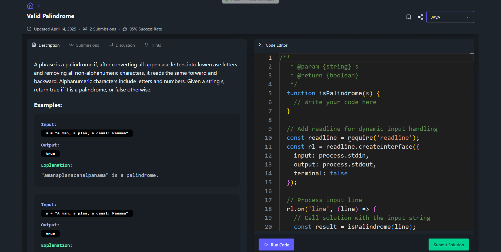
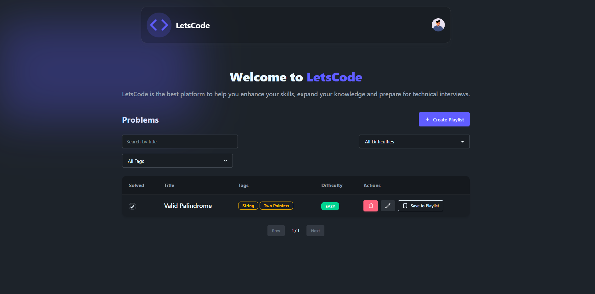

 Core Features
1. User Authentication:✅

   - Login and signup using JWT tokens.
   - Protected routes for authenticated users.

2. Admin Features:✅

   - Create custom coding problems.
   - Test problems with Judge0 before saving.
   - AI-generated problem creation. ( on hold)

3. Problem Management:✅

   - Admin can view, edit, and delete problems.
   - Users can browse all available problems.

4. Code Execution:

   - Users can write and submit code in multiple languages.
   - Use Judge0 API for real-time code execution and result validation.

5. Submission Tracking:

   - Save user submissions to the database.✅
   - Mark problems as "Solved" after successful submission.✅

6. Progress Tracking:

   - Highlight solved problems for users.
   - Display user progress (e.g., number of problems solved).

---
AI-Powered Features

1. Problem Recommendations:

   - Recommend problems based on user skill level and past performance.

2. Solution Assistance:

   - Provide hints or partial solutions for stuck users.
   - Debugging assistance for submitted code.

4. AI-Generated Problems:
   - Automatically generate new coding problems with test cases and solutions.

 Frontend Features

1. Responsive Design:

   - Clean and Modern UI using Daisy-UI and Tailwind CSS.
   - Dark mode support.

2. Code Editor:

   - Integrate Monaco Editor  for writing and submitting code.

3. Real-Time Feedback:

   - Display code execution results (e.g., "Accepted", "Wrong Answer") immediately.

4. Dashboard:

   - Show user statistics (e.g., solved problems, accuracy rate).