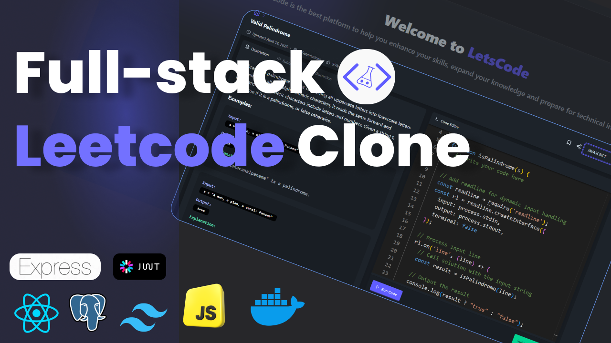

```bash
npx prisma init
```

This will create a new `prisma/` folder with a `schema.prisma` file inside, and also add a `.env` file at the root of your project.

If you haven't installed Prisma yet, first install it with:

```bash
npm install prisma --save-dev
```

And if you also want the Prisma Client to query your database:

```bash
npm install @prisma/client
```


docker run --name my-postgres -e POSTGRES_USER=myuser -e POSTGRES_PASSWORD=mypassword -p 5432:5432 -d postgres


# LeetCode Clone - Problem Solving Platform

---


## 🌟 About the Project

This is a **LeetLab - A Leetcode Inspired Product** designed to help developers practice coding challenges in multiple programming languages (JavaScript, Python, Java). The platform includes features such as:

- **Dynamic Code Editor**: Powered by Monaco Editor, allowing users to write and test code in real-time.
- **Problem Descriptions**: Detailed problem descriptions, examples, constraints, and hints.
- **Test Cases**: Predefined test cases for each problem to validate solutions.
- **Multi-Language Support**: Write solutions in JavaScript, Python, or Java.
- **Submission Tracking**: View submission history, memory usage, runtime, and status (Accepted, Wrong Answer, etc.).
- **Responsive Design**: Built with modern UI/UX principles for a seamless experience on all devices.

---

## 🚀 Features

### 1. **Interactive Code Editor**

- Real-time syntax highlighting using the Monaco Editor.
- Supports JavaScript, Python, and Java.

### 2. **Dynamic Input Parsing**

- Users can submit input dynamically via `readline` or predefined test cases.

### 3. **Problem Details**

- Each problem includes:
  - Description
  - Examples with inputs, outputs, and explanations
  - Constraints
  - Editorial (hints and optimal solutions)

### 4. **Execution and Submission**

- Run code directly in the browser and get instant feedback.
- View execution results, including runtime, memory usage, and error messages.

### 5. **User Authentication**

- Secure login and registration for tracking user progress and submissions.

### 6. **Admin Panel**

- Admins can add new problems, manage submissions.

---

## 🛠️ Tech Stack

- **Frontend**: React.js, Tailwind CSS, Monaco Editor
- **Backend**: Node.js, Express.js
- **Database**: PostgreSQL (or Prisma ORM)
- **Authentication**: JWT (JSON Web Tokens)
- **Code Execution**: Judge0 API (for running and validating code submissions)
- **State Management**: Zustand (React state management library)
- **Version Control**: Git, GitHub

---

## 📦 Installation and Setup

### Prerequisites

- Node.js (v16 or higher)
- npm or yarn
- PostgreSQL database
- Judge0 API 
### Steps to Run Locally

1. **Clone the Repository**

   ```bash
   git clone https://github.com/Aestheticsuraj234/chai-or-leetcode.git
   cd backend
   cd frontend
   ```

2. **Install Dependencies**

   ```bash
   npm install
   ```

3. **Set Up Environment Variables**
   Create a `.env` file in the root directory and add the following variables:
   ```env
   PORT =
   DATABASE_URL=
   JWT_SECRET=
   JUDGE0_API_URL=http://localhost:2358/
   ```

4. **Run the Development Server**
```bash
npm run dev
````


---


## 📝 Contributing

We welcome contributions from the community! Here’s how you can help:

1. **Fork the Repository**
2. **Create a New Branch**
   ```bash
   git checkout -b feature/your-feature-name
   ```
3. **Commit Your Changes**
   ```bash
   git commit -m "Add your feature description"
   ```
4. **Push to the Branch**
   ```bash
   git push origin feature/your-feature-name
   ```
5. **Open a Pull Request**


Here’s the categorized table for the tasks you’ve listed, organized into **Bug Fixes**, **Enhancements**, and **New Features**:

---

### **Categorized Tasks**

| **Category**       | **Task Description**                                                                                     | **Focus Area**                                                                 |
|---------------------|---------------------------------------------------------------------------------------------------------|--------------------------------------------------------------------------------|
| **Bug Fixes**      | On problem load, there is an issue with the editor.                                                     | Debugging and fixing editor initialization issues.                            |
|                     | Fix the profile page current UI.                                                                       | Improving UI/UX consistency on the profile page.                               |
|                     | Fix the syntax highlighting of My Submissions in the profile.                                           | Ensuring proper syntax highlighting for code submissions.                      |
|                     | Not handled empty states properly.                                                                     | Adding proper error handling and placeholder content for empty states.         |
|                     | Fix the proper indentation issue while creating a question in the add problem section.                  | Ensuring clean formatting and validation for problem creation.                 |
| **Enhancements**   | Add Syntax Highlighting for Output.                                                                    | Enhancing UI/UX by improving readability of outputs (e.g., JSON, arrays).      |
|                     | Add Light and Dark Mode Toggle Functionality.                                                          | Improving user experience with theme preferences.                              |
|                     | Enhance Our Code Editor (e.g., Code Formatting, Auto-completion, Add Custom Test Cases).                | Upgrading the editor with advanced features for better usability.              |
|                     | Proper Profile Tracking (like LeetCode) with Contribution Graph.                                        | Adding detailed tracking and visualization for user progress.                  |
|                     | A Great Landing Page and Proper Navigation Routes.                                                     | Improving the first impression and navigation flow of the platform.            |
| **New Features**   | Add Code Submit and Code Running Logic.                                                                | Implementing core functionality for running and submitting code.               |
|                     | Make a dynamic function to handle `readline` for dynamic input handling.                                | Supporting interactive input for coding challenges.                            |
|                     | Integrate Free AI Models into This Application.                                                        | Adding AI-powered features like hints, suggestions, or explanations.           |
|                     | Like, Unlike, Save, Mark for Revision.                                                                 | Adding social and study-tracking features for problems.                        |

---

